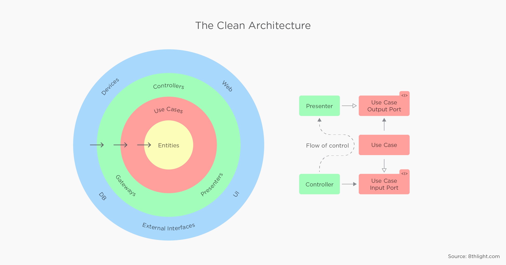

<h1 align="center">Go Transactions :bank:</h1>

## Arquitetura
-  A arquitetura é baseada nos conceitos de Clean Architecture propostas por Uncle Bob. Para mais detalhes clique [aqui](https://blog.cleancoder.com/uncle-bob/2012/08/13/the-clean-architecture.html).



## Requisitos
- Docker
- Docker-compose

## Começando

- Iniciar aplicação na porta :3001

```sh
make start
```

- Rodar os testes utilizando um container

```sh
make test
```

- Rodar os testes utilizando a máquina local

```sh
make test-local
```

- Ver os logs da aplicação

```sh
make logs
```

- Destruir aplicação

```sh
make down
```

## API Endpoint

| Endpoint           | Método HTTP           | Descrição             |
| :----------------: | :-------------------: | :-------------------: |
| `/v1/accounts`     | `POST`                | `Criar conta`         |
| `/v1/accounts`     | `GET`                 | `Buscar conta por ID` |
| `/v1/transactions` | `POST`                | `Criar transação`     |
| `/v1/health`       | `GET`                 | `Health check`        |

## Operações

| ID                                     | Descrição           | Tipo     |
| :------------------------------------: | :-----------------: | :------: |
| `fd426041-0648-40f6-9d04-5284295c5095` | `COMPRA A VISTA`    | `DEBIT`  |
| `b03dcb59-006f-472f-a8f1-58651990dea6` | `COMPRA PARCELADA`  | `DEBIT`  |
| `3f973e5b-cb9f-475c-b27d-8f855a0b90b0` | `SAQUE`             | `DEBIT`  |
| `976f88ea-eb2f-4325-a106-26f9cb35810d` | `PAGAMENTO`         | `CREDIT` |

## Testar API usando curl

- #### Criar conta

| Parâmetro    | Obrigatório  | Tipo       | Regras
| :----------: | :----------: | :--------: | :---------:
| `document`   | `Sim`        | `Object`   |           |
| `document.number`     | `Sim`        | `String`   | `Máximo 30 caracteres` |

`Request`
```bash
curl -i --request POST 'http://localhost:3001/v1/accounts' \
--header 'Content-Type: application/json' \
--data-raw '{
    "document": {
        "number": "12345678900"
    }
}'
```

`Response`
```json
{
    "id": "1a4028ea-3c18-4714-b650-d1058ae7a053",
    "document": {
        "number": "12345678900"
    },
    "created_at": "2020-10-17T02:28:05Z"
}
```

- #### Buscar conta por ID

`Request`
```bash
curl -i --request GET 'http://localhost:3001/v1/accounts/1a4028ea-3c18-4714-b650-d1058ae7a053'
```

`Response`
```json
{
    "id": "1a4028ea-3c18-4714-b650-d1058ae7a053",
    "document": {
        "number": "12345678900"
    },
    "created_at": "2020-10-17T02:28:05Z"
}
```

- #### Criar transação

| Parâmetro       | Obrigatório  | Tipo       | Regras     |
| :-------------: | :----------: | :--------: | :--------: |
| `account_id`    | `Sim`        | `String`   |            |
| `operation_id`  | `Sim`        | `String`   |            |
| `amount`        | `Sim`        | `Float`    |  `Maior que zero`|

`Request`
```bash
curl --location --request POST 'http://localhost:3001/v1/transactions' \
--header 'Content-Type: application/json' \
--data-raw '{
    "account_id": "1a4028ea-3c18-4714-b650-d1058ae7a053",
    "operation_id": "3f973e5b-cb9f-475c-b27d-8f855a0b90b0",
    "amount": 100
}'
```

`Response`
```json
{
    "id": "22985ca3-c777-4ab2-b433-ba3b6844578d",
    "account_id": "1a4028ea-3c18-4714-b650-d1058ae7a053",
    "operation": {
        "id": "fd426041-0648-40f6-9d04-5284295c5095",
        "description": "COMPRA A VISTA",
        "type": "DEBIT"
    },
    "amount": -100,
    "created_at": "2020-10-17T22:17:40Z"
}
```


  
